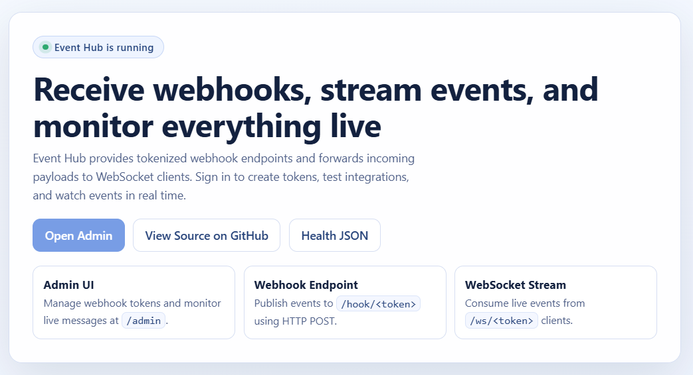
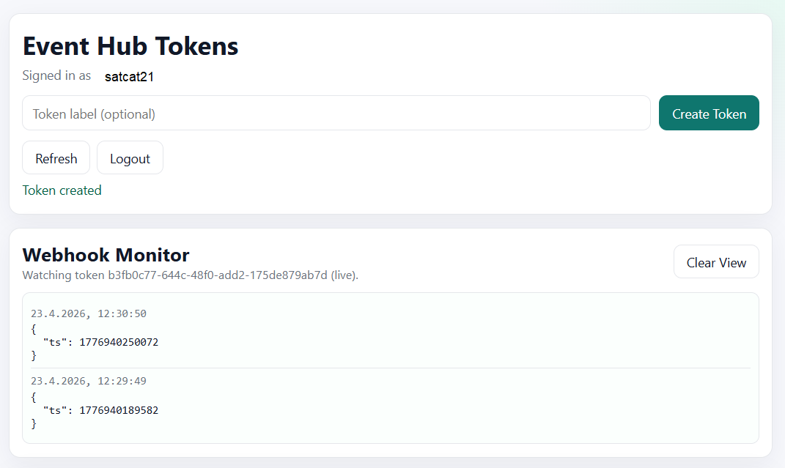

# Event Hub

Event Hub is a small webhook gateway for payment and event notifications.

It lets you:
- create tokenized webhook endpoints
- receive webhook POST payloads on token URLs
- fan out incoming payloads to WebSocket clients for the same token
- monitor webhook events in a browser admin UI
- protect admin endpoints with OIDC login (Zitadel)

## Purpose

This project is useful when you want one stable webhook URL per integration and real-time delivery to downstream apps.

Typical flow:
1. Create token in admin UI
2. Use generated webhook URL in external service (for example LNbits LNURLp)
3. Connect your consumer to generated WebSocket URL
4. Receive events in real time

## Features

- OIDC login with Authorization Code + PKCE
- Token management UI at /admin
- Webhook monitor with event history and live stream
- Token persistence across restarts (file-based)
- Token-specific WebSocket channels

## Screenshots

### Landing Page



### Admin Monitor



## Endpoints

- GET /
  - Landing page with links to admin, health endpoint, and source repository
- GET /health
  - JSON health check
- GET /auth/login
  - Starts OIDC login
- GET /auth/callback
  - OIDC callback endpoint
- GET /admin
  - Protected admin UI
- GET /admin/tokens
  - Protected token list API
- POST /admin/tokens
  - Protected token create API
- DELETE /admin/tokens/:token
  - Protected token delete API
- GET /hook/:token
  - Returns endpoint status/help text
- POST /hook/:token
  - Webhook ingestion endpoint
- WS /ws/:token
  - WebSocket stream for a token

## Installation

### Option A: Docker Compose (recommended)

1. Copy .env.example to .env and set values.
2. Create the data directory and make it writable for the container user (uid 1000, `node`):

```bash
mkdir -p data && sudo chown 1000:1000 data
```

3. Build and run:

```bash
docker compose up -d --build
```

4. Open:
- BASE_URL/auth/login
- after login you should be redirected to BASE_URL/admin

### Option B: Local Node.js

Requirements:
- Node.js 26+

Steps:

```bash
npm install
```

Create .env (copy from .env.example), then start:

```bash
node src/server.js
```

## Environment Variables

See .env.example for the full list.

Important values:
- APP_PORT: application listen port
- BASE_URL: public HTTPS URL used for redirects and generated webhook/ws URLs
- GITHUB_URL: repository URL shown on landing page
- SESSION_SECRET: express-session signing secret
- TOKENS_FILE: file path for persisted tokens
- ZITADEL_ISSUER: Zitadel issuer URL
- ZITADEL_CLIENT_ID: Zitadel app client ID
- ZITADEL_CLIENT_SECRET: optional for confidential client, empty for public PKCE client

## Token Persistence

Tokens are persisted to TOKENS_FILE. In Docker Compose, ./data is mounted to /app/data so tokens survive container restarts. The container runs as the unprivileged `node` user (uid 1000), so ./data must be owned by or writable for uid 1000 on the host.

## Zitadel OIDC Setup Guide

Use a dedicated application in Zitadel for Event Hub.

1. Create application
- Type: Web
- Response Type: Code
- Grant Type: Authorization Code
- Authentication Method:
  - None for Public + PKCE
  - client secret method for Confidential client

2. Redirect URI
- Add exactly:
  - https://webhook.your-domain/auth/callback

3. PKCE
- Enable PKCE (S256)

4. Copy credentials to .env
- ZITADEL_ISSUER=https://your-zitadel-domain
- ZITADEL_CLIENT_ID=<client-id>
- ZITADEL_CLIENT_SECRET=<optional; empty for public client>

5. Ensure BASE_URL matches your public domain exactly
- BASE_URL=https://webhook.your-domain

6. Restart app after env changes

## Usage

1. Login at /auth/login
2. Open /admin
3. Create a token
4. Copy webhook and WebSocket URLs
5. Configure external service to POST to webhook URL
6. Connect your consumer to WebSocket URL
7. In admin, click Watch to inspect incoming events

## Testing Webhook Delivery

### curl test

```bash
TOKEN="your-token"
curl -i -X POST "https://webhook.your-domain/hook/${TOKEN}" \
  -H "Content-Type: application/json" \
  -d '{"test":"ping","source":"curl"}'
```

Expected result: HTTP 200 OK

### Browser endpoint check

Open:
- https://webhook.your-domain/hook/your-token

This is a GET availability check only. Real webhook delivery must use POST.

## Troubleshooting

- Cannot GET /hook/<token>
  - Use POST for actual webhook delivery.
- OIDC callback returns authentication failed
  - Verify redirect URI, BASE_URL, client type, and PKCE settings.
- Login works but no websocket processing
  - Verify your consumer is connected to WS /ws/<token> and parses incoming JSON.
- curl works but external service does not
  - Check sender logs and payload format; verify sender is using exact webhook URL.

## Security Notes

- Replace SESSION_SECRET in production.
- Use HTTPS in front of the app.
- For production scale, replace in-memory session store with Redis or another shared store.
